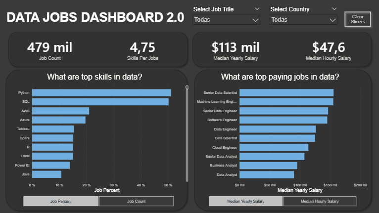
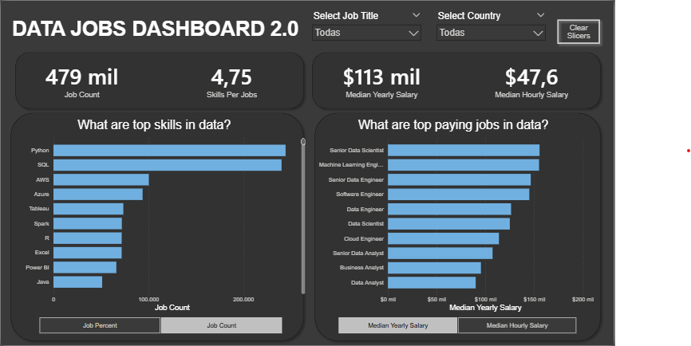

⬅️ **[Back to Dashboard Repository](../)**

# Data Jobs Dashboard v2 – Skills, Compensation & Demand Analysis

## Interactive Version

Due to Power BI Service licensing limitations, the interactive version is not publicly available. The .pbix file is included in this repository.

Here is a preview of the dashboard:

### Dashboard File
You can download the Power BI file here:  
[`Dashboard_Project_02.pbix`](Dashboard_Project_02.pbix).

---

## Project Overview

This dashboard focuses on the relationship between technical skills, salary levels, and job demand within the data job market.

Rather than simply presenting aggregated metrics, this project explores:

- How specific skills correlate with compensation
- Which job titles command higher pay
- The distribution of skills across roles
- The relative demand intensity for each position

The objective is to transform raw job posting data into a structured analytical tool that highlights how skill composition influences market value.

---

## Analytical Focus

This version shifts from a general labor market overview to a more analytical perspective:

- Skill frequency vs job count  
- Skill presence vs median salary  
- Comparative analysis between job titles  
- Dynamic metric switching (counts vs percentages)  

The dashboard enables users to explore whether higher-paying roles are associated with specific skill clusters and how demand concentration varies across positions.

---

## Data Modeling & Technical Implementation

### 🔹 Power Query (ETL & M Language)

- Data cleaning and transformation  
- Handling null values and inconsistent data types  
- Structuring exploded skill tables  
- Creating calculated columns for modeling  
- Preparing the dataset for accurate aggregation  

Custom transformations were implemented using Power Query and M expressions to ensure clean and reliable data modeling.

---

### 🔹 DAX & Measures

The analytical layer was built using DAX measures to support:

- Median salary calculations  
- Distinct counts across job postings  
- Context-aware aggregations  
- Conditional logic for dynamic metrics  
- Controlled filter interactions  

Special attention was given to granularity issues when working with skill-level exploded datasets.

---

### 🔹 Dynamic Metric Switching

This version introduces metric switching functionality, allowing users to alternate between:

- Absolute job counts  
- Relative job percentages  

The implementation required dynamic formatting and measure-level logic to maintain clarity across visual contexts.

---

## Dashboard Structure

### Page 1 – Skills & Demand Overview

This page presents the relationship between skills, compensation, and job demand.  
Users can explore how specific job titles differ in:

- Skill concentration  
- Median salary levels  
- Market demand intensity  

The layout prioritizes interpretability and analytical clarity.

---

## Lessons & Technical Insights

- The importance of distinct counts when working with exploded skill tables  
- How data granularity affects aggregation results  
- Managing filter context in dynamic measures  
- Formatting challenges when switching between absolute values and percentages  
- The necessity of proper data modeling before visualization  

---

## Conclusion

This dashboard demonstrates how Power BI can be used not only for visualization, but for structured analytical reasoning.

By connecting skills, salary, and demand, it provides a clearer understanding of how technical competencies translate into market value within the data job ecosystem.