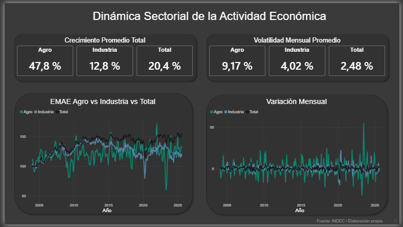
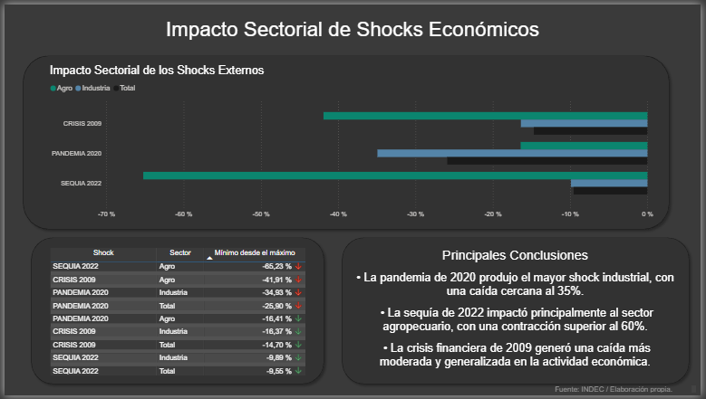
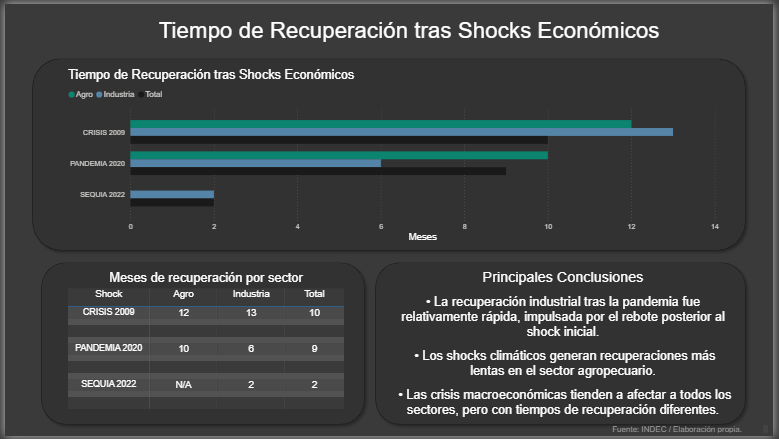

⬅️ **[Back to Dashboard Repository](https://github.com/fernando-aquilino/Dashboards_Power_BI)**

# Argentina Economic Activity – Sector Shock Analysis

This project analyzes how different sectors of the Argentine economy respond to major macroeconomic shocks using the **EMAE (Monthly Economic Activity Estimator)** published by INDEC.

The analysis combines a **Python data pipeline** with a **Power BI dashboard** to explore three main dimensions:

1. Structural dynamics of economic sectors  
2. Impact of major economic shocks  
3. Time required for sectors to recover after shocks  

### Dashboard File
You can find the file for the dashboard here: [`EMAE_Shock_Analysis.pbix`](Dashboards/EMAE_Shock_Analysis.pbix). 

---

# Project Overview

The goal of this project is to understand how different sectors of the economy react to crises and how long they take to recover.

Three major shocks are analyzed:

- Global Financial Crisis (2009)
- COVID-19 Pandemic (2020)
- Drought Shock (2022)

The sectors analyzed are:

- Total Economic Activity
- Agriculture
- Manufacturing Industry

---

# Methodology

The analysis is based on **seasonally adjusted EMAE series**.

Three datasets are generated through a Python pipeline:

### 1️⃣ Structural Dataset
Measures long-term sector dynamics.

Metrics calculated:
- Average monthly growth
- Monthly volatility

### 2️⃣ Shock Impact Dataset
Measures the **peak-to-trough decline** during each crisis.

Method:
- Identify the **maximum level before the shock**
- Identify the **minimum level after the shock**
- Compute percentage decline

### 3️⃣ Recovery Dataset
Measures how long it takes each sector to return to its pre-shock level.

Method:
- Identify the crisis trough
- Track forward until the pre-shock level is reached
- Count months to recovery

---

# Dashboard

The Power BI dashboard contains three pages:

### Page 1 — Sector Dynamics



Shows long-term evolution of EMAE by sector.

Includes:
- Sector growth comparison
- Sector volatility comparison
- Monthly variation visualization

### Page 2 — Impact of Economic Shocks



Compares how strongly each sector was affected by:

- 2009 financial crisis
- 2020 pandemic
- 2022 drought

Metric used:
Peak-to-trough percentage decline.

### Page 3 — Recovery Time



Measures how long sectors take to recover after each shock.

Metric used:
Months required to return to the pre-shock level.

---

# Tools Used

- Python (data pipeline)
- Pandas (data processing)
- Power BI (data visualization)

---
## Project Structure

```
economic-data-projects
│
├── src
│   └── pipeline.py
│
├── data
│   └── EMAE_Limpio.csv
│
├── outputs
│   ├── dataset_mensual_emae.csv
│   ├── pagina1_tabla_estructural.csv
│   ├── pagina2_shocks.csv
│   └── pagina3_recuperacion.csv
│
├── dashboard
│   └── EMAE_Shock_Analysis.pbix
│
├── images
│   ├── pag1_estructura.png
│   ├── pag2_impacto.png
│   ├── pag3_recuperacion.png
│
└── README.md
```
# Key Insights

Some important patterns emerge from the analysis:

- The **COVID-19 pandemic produced the largest industrial shock**, with a sharp contraction in manufacturing activity.
- The **2022 drought had the strongest impact on the agricultural sector**.
- The **2009 global crisis generated a broader but more moderate contraction across sectors**.
- Recovery dynamics differ significantly between sectors and shocks.

---

# Future Improvements

Possible extensions of this project:

- Add more sectors from the EMAE dataset
- Compare recoveries across multiple crises
- Build a predictive model for recovery speed

---

# Author

Fernando Aquilino  
Economics student – Universidad de Buenos Aires  
Data analysis projects combining economics and data science.