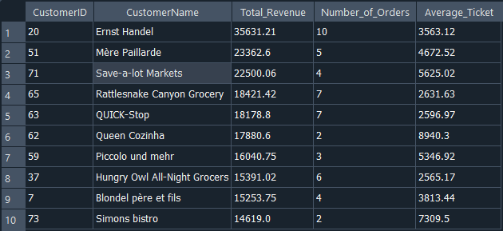
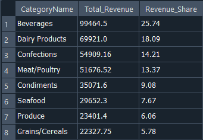
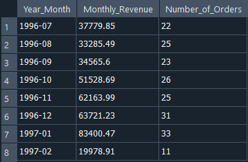
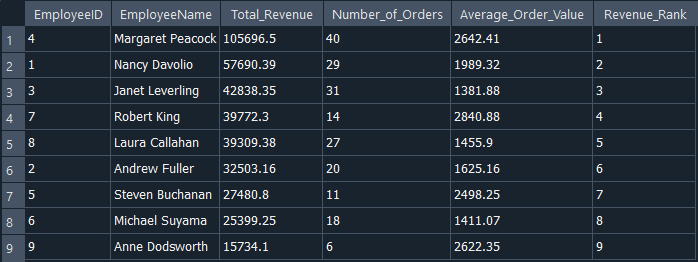
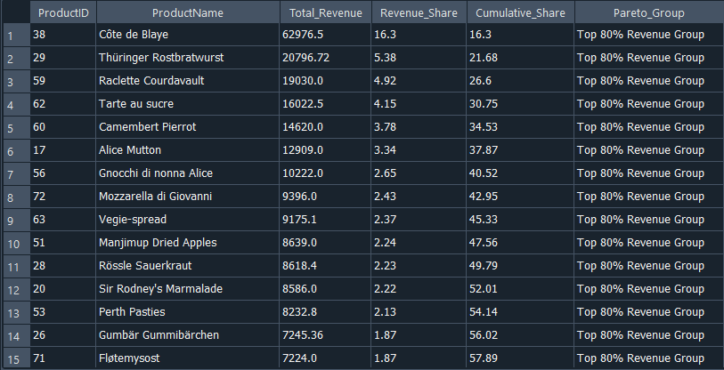
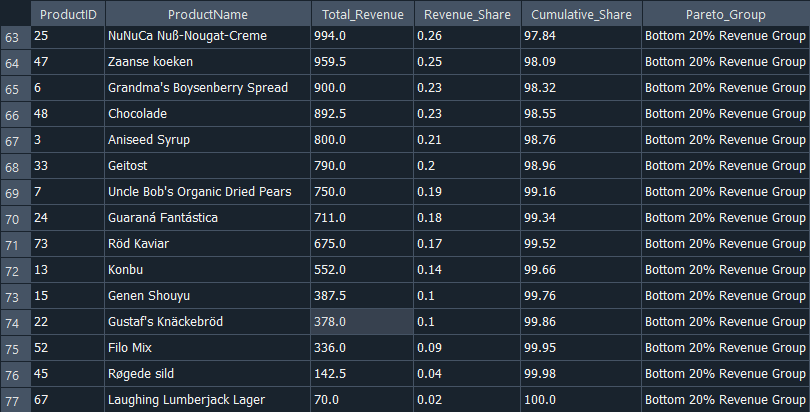

⬅️ **[Back to Dashboard Repository](https://github.com/fernando-aquilino/Dashboards_Power_BI)**

# SQL Sales Analysis – Northwind Dataset

This project explores sales performance using the **Northwind database** through SQL queries designed to answer common business questions.

The analysis focuses on customers, product categories, employees, and revenue concentration to illustrate how SQL can be used for business intelligence and data analysis.

---

# Dataset

The analysis uses the **Northwind SQLite sample database**, a relational dataset commonly used for SQL learning and analytics practice.

Main tables used:

- Customers
- Orders
- OrderDetails
- Products
- Categories
- Employees

These tables were joined to construct a unified **sales dataset** including revenue, product information, customer details, and employee performance.

---

# Business Questions

The project answers five key analytical questions:

## 1️⃣ Top Customers by Revenue

Identify which customers generate the highest revenue and analyze their purchasing behavior.

Metrics used:

- Total revenue
- Number of orders
- Average order value

---

## 2️⃣ Revenue by Product Category

Analyze how revenue is distributed across product categories to identify the most valuable segments.

Metrics used:

- Total revenue by category
- Share of total revenue

---

## 3️⃣ Monthly Sales Trend

Explore how sales evolve over time by aggregating revenue and number of orders by month.

Metrics used:

- Monthly revenue
- Monthly order count

---

## 4️⃣ Employee Sales Performance

Evaluate sales performance by employee to identify top contributors.

Metrics used:

- Total revenue generated
- Number of orders handled
- Average order value
- Revenue ranking

---

## 5️⃣ Product Revenue Concentration

Analyze how revenue is distributed across products and identify concentration patterns using a Pareto-style approach.

Metrics used:

- Revenue per product
- Revenue share
- Cumulative revenue share
- Pareto grouping (Top 80% vs Bottom 20%)

---

# SQL Techniques Used

The project demonstrates several core SQL techniques used in data analysis:

- **JOINs** to combine relational tables
- **Aggregations** with `SUM`, `COUNT`, and `GROUP BY`
- **Common Table Expressions (CTEs)** to structure analytical queries
- **Window Functions** (`SUM() OVER`, `RANK()`) for advanced analytics
- **Date transformations** using `strftime()` for time-based analysis

---

# Project Structure
sql-sales-analysis-northwind
│
├── queries
│ ├── 00_base_sales_query.sql
│ ├── 01_top_customers.sql
│ ├── 02_revenue_by_category.sql
│ ├── 03_monthly_sales_trend.sql
│ ├── 04_employee_sales_performance.sql
│ └── 05_product_revenue_concentration.sql
│
├── images
│
└── README.md

---

# Key Insights

Some insights derived from the analysis:

- A small subset of customers generates a disproportionate share of total revenue.
- Certain product categories dominate total sales.
- Sales increased toward the end of 1996, with peaks around the holiday season.
- Employee performance varies significantly across the sales team.
- Revenue is concentrated in a limited number of products, consistent with a **Pareto distribution**.

---

# Tools Used

- SQL
- SQLite
- DB Browser for SQLite
- Visual Studio Code

---

# Author

**Fernando Aquilino**

Economics Student – University of Buenos Aires  
Interested in **Data Analysis, Business Intelligence, and Economic Data**.

GitHub:  
https://github.com/fernando-aquilino